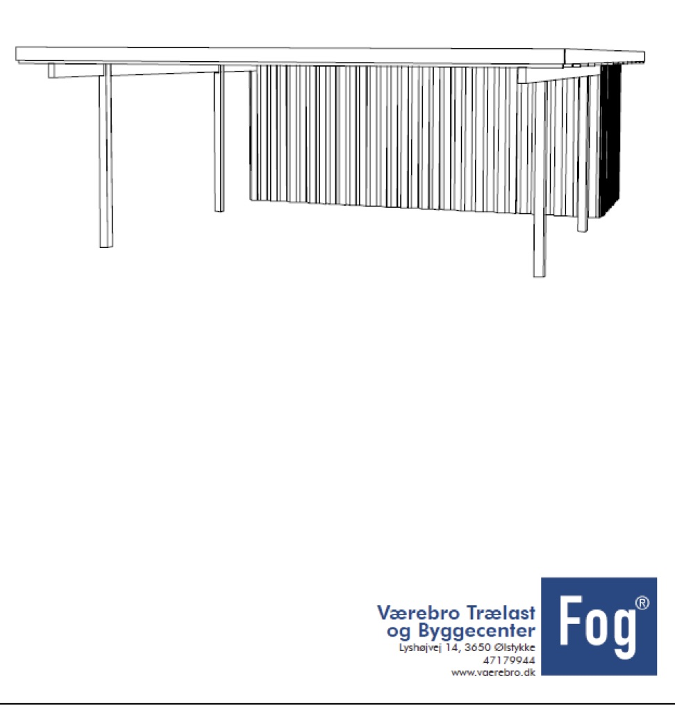
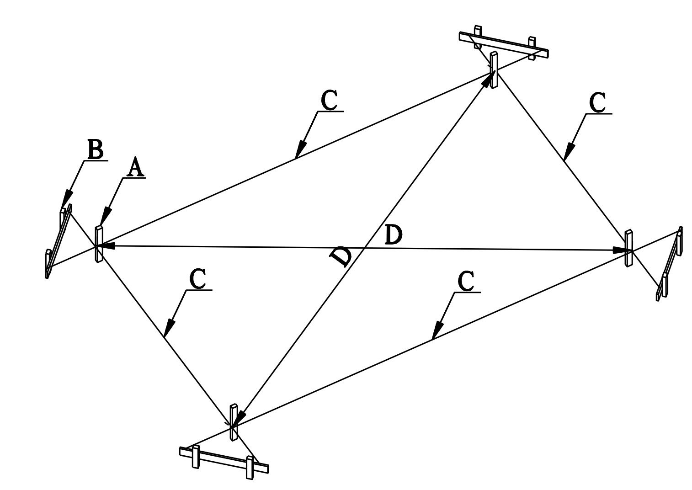
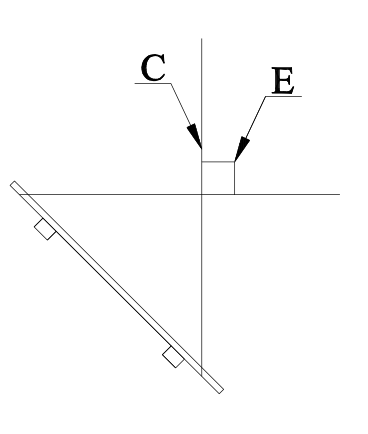


# CP01 DUR
## 2016
### 6,0 X 7,8 MTR.





## Contents

Description | Length | Count | Unit|Description
---|---|---|---|---|---
**Træ & Tagplader**|
25x200 mm. trykimp. Brædt | 360 | 4 | Stk|understernbrædder til for & bag ende
25x200 mm. trykimp. Brædt | 540 | 4 | Stk|understernbrædder til siderne
25x125mm. trykimp. Brædt | 360 | 2 | Stk|oversternbrædder til forenden
25x125mm. trykimp. Brædt | 540 | 4 | Stk|oversternbrædder til siderne
38x73 mm. Lægte ubh. | 420 | 1 | stk|til z på bagside af dør 
45x95 mm. Reglar ub. | 270 | 12 | stk|løsholter til skur gavle 
45x95 mm. Reglar ub. | 240 | 4 | stk|løsholter til skur sider
45x195 mm. spærtræ ubh. | 600 | 2 | Stk|Remme i sider, sadles ned i stolper
45x195 mm. spærtræ ubh. | 480 | 1 | Stk|Remme i sider, sadles ned i stolper ( skur del, deles)
45x195 mm. spærtræ ubh. | 600 | 15 | Stk|Spær, monteres på rem 
97x97 mm. trykimp. Stolpe | 300 | 11 | stk|Stolper nedgraves 90 cm. i jord
19x100 mm. trykimp. Brædt   | 210 | 200 | stk|til beklædning af skur 1 på 2 
19x100 mm. trykimp. Brædt   | 540 | 4 | Stk|vandbrædt på stern i sider
19x100 mm. trykimp. Brædt   | 360 | 2 | Stk|vandbrædt på stern i forende
Plastmo Ecolite blåtonet | 600 | 6 | Stk|tagplader monteres på spær 
Plastmo Ecolite blåtonet | 360 | 6 | Stk|tagplader monteres på spær 
**Beslag & Skruer** |
plastmo bundskruer 200 stk. |  | 3 | pakke|Skruer til tagplader
hulbånd 1x20 mm. 10 mtr. |  | 2 | Rulle|Til vindkryds på spær
universal 190 mm højre |  | 15 | Stk|Til montering af spær på rem
universal 190 mm venstre |  | 15 | Stk|Til montering af spær på rem
4,5 x 60 mm. skruer 200 stk. |  | 1 | Pakke|Til montering af stern&vandbrædt
4,0 x 50 mm. beslagskruer 250 stk. |  | 3 | pakke|Til montering af universalbeslag + hulbånd
 bræddebolt 10 x 120 mm.  |  | 18 | Stk|Til montering af rem på stolper
firkantskiver 40x40x11mm |  | 12 | Stk|Til montering af rem på stolper
4,5 x 70 mm. Skruer 400 stk. |  | 2 | pk.|til montering af yderste beklædning
4,5 x 50 mm. Skruer 300 stk.  |  | 2 | pk.|til montering af inderste beklædning
stalddørsgreb 50x75 |  | 1 | Sæt|Til lås på dør i skur
t hængsel 390 mm |  | 2 | Stk|Til skurdør
vinkelbeslag 35 |  | 32 | Stk|Til montering af løsholter i skur





## BYGGEVEJLEDNING TIL DOBBELT CARPORT MED FLADT TAG

### MODEL CP01 DUR

    

Husk ved modtagelse, at kontrollere de leverede materialer i forhold til styklisten.


1. Grundplan afsættes ved at hamre en stump lægte (A) i jorden til ca. markering af carportens hjørnestolper, en pæl i hvert hjørne.
Stolpe placering kan ses på tegning.
2. Ca. 30.cm ud for markeringen opsættes en galje (B) ca. 30.cm høj over jorden.
Her holdes en afstand af 20.cm fra jordhøjde til overkant af tværbræt galje. Brug vaterpas.
Det vil lette arbejdet senere hvis de 4 tværbrædder er i samme højde, afsæt højden fra det ene tværbræt til det næste med et langt lige bræt og vaterpas.

3. En muresnor (C) hæftes ovenpå tværbrætet - flugtende med lægtestumpen til markering af hjørnestolper. Her hamres søm i overkant af tværbræt, til at spænde snor fast på, hvilket gøres på alle fire sider, så der fremkommer et rektangel imellem galjerne.

4. Derefter tages diagonalmål (D) som SKAL være det samme mål på begge diagonaler.
Når diagonalmålet er det samme på begge diagonaler er det afsatte mål i vinkel. Det er vigtigt disse er i vinkel.

5. Nu skal stolpehuller bores i jorden. 
Brug et pælebor som passer til stolpernes tykkelse, samt en pælespade. 
Bemærk ydersiden af stolpen (E) skal flugte snoren (C).  Hullerne bores max 90.cm dybe i fronten og max 100.cm dybe bagtil hvilket giver fald på tagfladen. Husk at bundsikre så stolpe ikke sætter sig.
Forreste stolper skal være 208 cm. Høje og bagerste skal være 202 cm.
Kan evt. skæres til efter montering af rem.
Husk at tage højde for, hvis terrænet skråner.

6. Montering af stolper: 
Placer stolper, og kontroller at disse er lodrette og stamp tæt til med blanding af jord og sten.
Det kan lette arbejdet, hvis stolperne afstives med to skråstivere når de er placeret og oprettet derved er det nemmere at holde placeringen, når hullerne omkring stolperne fyldes. Ønskes ekstra stabilitet kan her også støbes med tørbeton/vand, eller cement-grus-sten blanding i forhold 1:4:4.  (eller cement/grus i forhold 1:8)+vand så blandingen er jordfugtig.
Bemærk at stolper er imprægneret til montering direkte i jord

Hvis der mod vor anbefaling anvendes stolpeanker/stolpesko, skal der etableres ekstra vindafstivning, f.eks. carportens ene side fastgøres til hus, eller der monteres ekstra skråstivere fra stolper til remme/spær overalt. 


7. Udskæring i stolpen til remmen:
Remmen levers i spærtræ 45x195  mm. 
Når stolper er monteret, Skæres et hak/blad udvendig i toppen af hver stolpe (E)
til remmen (F)
Der skal skæres ud, så remmen flugter eller er lidt højere end toppen af stolpen, 
Så remmen får et fald bagud på carporten.
Dette gøres nemmest ved at holde remmen op mod stolpen og fast holde med en skrue tvinge.
Sæt højden på oversiden af remmen ved forreste stolpe til, 209 cm. (Ved plan grund) og sænke bagenden til 200 cm. ved bagerste stolpe, derefter kan der streges op på stolperne, så får du lavet et saddelhakket med fald på. Bemærk at faldet kan øges hvis man ønsker det, ved at sænke bagenden.

Læg remmen i udskæringen på toppen af stolperne (fasthold evt. med skruetvinger under monteringen) og bor hul til bræddebolte, 2 stk. pr. stolpe, 
som monteres fra udvendig side, skive og møtrik spændes på indersiden.
Bemærk at remmen samles af 2 stykker, over den stole der er mellem skur og carport,
Samlingen centreres over stolpen og der anvendes i alt 4 bolte til denne samling.
Vær opmærksom på, at træet kan have pilhøjde, dvs. at træet buer svagt,
Kontroller og placer remmen så evt. pilhøjde er opad.
Træet leveres på fod mål, dvs. længde kan variere få cm. Og skal renskæres på mål før opsætning.
















(mål på rem påføres tegning)

8. Montering af spær beslag:
Universal/spær beslag til fastgørelse af spær på rem.
Start med at opmærke på oversiden af remmene, hvor det forreste og det bagerste spær skal placeres. Opmærk på begge sidder af hvert spær, spæret skal senere placeres imellem disse to streger. Der opmærkes på samme måde til de mellemliggende spær. 
Afstanden mellem spærene skal være ens max 60.cm
Montér universalbeslagene med vinklen mod bagsiden af spær/ovenpå rem, og fladen på indvendigt side af rem.(se tegning) Alle beslag monteres med 3 beslags skruer pr. flade i beslaget. Vær opmærksom på at der er højre og venstre beslag.  Ved det bagerste spær monteres beslaget på spærets forside af hensyn til stern eller beklædning.  










9. Montering af spær: 
Start med at kontrollere alle spær for pilhøjde, og renskær på mål.
Spær længde tilpasses til 5950 mm. På grund af dobbelt stern. 2 x 25 mm. Som monteres, så den flugter overkant spær.
Monter først det forreste og det bagerste spær, og mål nøjagtigt ud ved udhæng så der er samme afstand i begge sider. Træk en mursnor fra enden af spærene på den lange led af carporten.
De mellemliggende spær monteres, så de passer med snoren, hvilket sikrer lige langt udhæng.
Hvis spærene skal males kan det anbefales at gøre dette inden opsætning. (Bemærk at spærene, hvis de males, skal males i en lys farve på oversiden)










10. Montering af hulbånd: 
Hulbåndet monteres som vist på tegningen. Start med at fastgøre i den ene ende oven på spær, træk over til den anden side over spærene og stram op før fastgørelse, hvilken foregår med 1-2 beslags skruer i de spær der krydses. Pas på ved opstramningen at carporten ikke trækkes ud af vinkel, kontroller evt. diagonalmålet på toppen af stolperne, før skrues sømmes fast.
Vær også opmærksom på, at spæret kan “kæntre”, afstiv evt. med ekstra beslag.








11. Montering af Stern: 
Start med understernbræt (25 x 200 mm) som skal sidde på det forreste spær (den høje ende).
Afkort det så det har samme længde som spæret plus 5.cm. 
Monter sternbrættet så det er 2,5 cm længere end spæret i hver side og sternbrættets overkant flugter med spæret.
De to under Sternbrædder i siderne monteres ligeledes så de flugter overkant af spærene, og skrues fast i enderne af spærene. Længden tilpasses individuelt afhængig af om der monteres tagrende. (tagrende medfølger ikke)
Det bagerste under sternbræt afkortes og tilpasses så det passer imellem de to side sternbrædder, og skrues fast på bagerste spær. Bemærk: Overkant bagerste sternbræt skal også være lig med overkant af bagerste spær.
Her efter kan over sternen (25x125) monteres, på forenden, samt sider, men skal placeres 30 mm. Højere end spærene, således at trapez taget bliver skjult.


12. Montering af Trapez plader: 
Start med at lægge pladerne løst op, så de når ud til sternbrædderne i sider og front, bagerst skal pladerne række ca. 5.cm ud over sternbrættet, med henblik på afvanding.
Pladerne fordeles så de har et overlæg på min 2 bølger.
Bemærk at plader er delt i længde retningen, start med de korte plader i skurdelen, og lad de lange plader overlappe de korte, således at overlægget kommer i faldretningen.
 (Tilpasning sker bedst med en vinkelsliber)
Pladerne fastgøres med de leverede montageskruer, til montering i bunden. Se vejledning fra Plastmo.   

13. Afslutning:
På toppen af sternbrædderne i front og sider monteres et vandbrædt (19x100) som beskyttelse og overlap mellem tagplader og sternbræt.





       ********Øvrig tagbelægning: Se vejledning fra producent.********

God ARBEJDSLYST !

Anbefalet værktøj:	 Vaterpas	Mursnor	          Pælebor	 Spade	Sav
	 Hammer	Vinkel	             Træbor 12mm	 Skiftenøgle	Boremaskine
	 Skruemaskine	Wienerstige	     Skruetvinger
	 Specialværktøj kan lejes i vor velassorterede udlejningsafdeling.



































